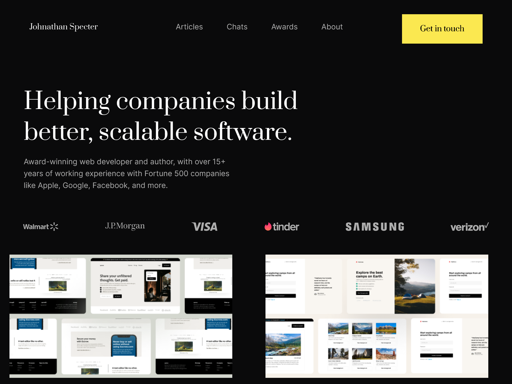
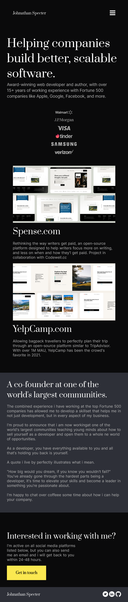

# Frontend Mentor - Notifications page solution


This is a solution to the [Web Developer Portfolio on Codewell.cc](https://www.codewell.cc/challenges/web-developer-portfolio--617d4897a383e41090a3e46f). Codewell challenges help you improve your coding skills by building realistic projects. 

## Table of contents

- [Overview](#overview)
  - [The challenge](#the-challenge)
  - [Screenshot](#screenshot)
  - [Links](#links)
- [My process](#my-process)
  - [Built with](#built-with)
  - [What I learned](#what-i-learned)
  - [Continued development](#continued-development)
  - [Useful resources](#useful-resources)
- [Author](#author)


## Overview

### The challenge

The task was to recreate the portfolio website.

### Screenshot






### Links

- Solution URL: [Github](https://github.com/KahlvynO/Dev-Portfolio)
- Live Site URL: [Netlify](https://codewellport.netlify.app)

## My process

### Built with

- Semantic HTML5 markup
- CSS
- Flexbox


### What I learned

Though there are certain syntax and styling attributes that i'm knowledgable of, i dont't get to use them often. Some of those many syntax i got to implement includes;


```css
#mobile {
    display: none;
}

#about {
    column-count: 2;
    column-gap: 50px;
}
```
 The first one helps in hiding the element from the viewport (screen).
 The second one helps in spliting a long body of text into two columns.


### Continued development

Going forward i'll focus more on:

- How best to use and apply relative values.
- Good and efficient ways of creating responsive layouts.


### Useful resources

- [W3schools](https://www.w3schools.com) - This served as a refresher for me when i needed a quick reminder of a certain syntax that skipped my mind or new styles that the project needed that i didn't know the correct syntax for.
- [Roadmap.sh](https://www.roadmap.sh) - This is an amazing site that contains roadmaps for different software developer tracks (e.g Frontend, Backend, React, Devops, etc.). It also contains links to resources.


## Author

- Website - [Calcodez](https://calcodez.netlify.app)
- Twitter - [@calcodez](https://www.twitter.com/calcodez)